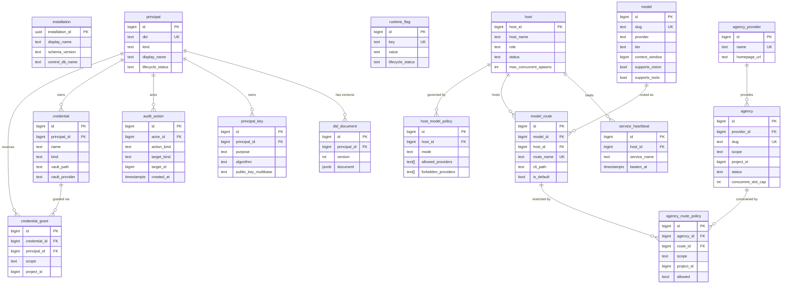

> **Type:** design note
> **MCP-tracked:** N/A (cross-cutting hiveCentral DDL)
> **Source-of-truth:** `database/ddl/hivecentral/` (DDL files are canonical; this document explains them)

# hiveCentral Data Model Design

The hiveCentral control-plane PostgreSQL database is the canonical source of truth for the AgentHive platform. It manages the proposal lifecycle engine, workforce governance, agent routing, cost attribution, and policy enforcement across all project tenants. This document describes the logical and physical data model, orchestration flows, security boundaries, and deployment patterns.

## Introduction

AgentHive operates on a two-tier PostgreSQL topology:

- **hiveCentral (control-plane):** Singleton database managing platform-wide control: agents, providers, models, routes, projects, policies, and governance
- **Project Tenant DBs:** One database per project tenant (e.g., `agenthive`, `monkeyKing-audio`, `georgia-singer`) holding proposal lifecycle, messages, and project-specific state

This separation of concerns ensures:
- **Multi-tenancy:** Projects are data-isolated by database, not row-level predicates
- **Scalability:** Tenant databases scale independently; control-plane remains lightweight and globally consistent
- **Security:** Tenant data never leaks across project boundaries; access control is enforced at the role level
- **Governance:** Cross-project policies, agent capabilities, and cost are tracked centrally

The schema design applies four architectural patterns consistently:

1. **Catalog Hygiene Block:** Every table has `owner_did`, `lifecycle_status` (active/deprecated/retired/blocked), `deprecated_at`, `retire_after`, `notes`, `created_at`, `updated_at` with automatic trigger-based timestamp updates
2. **Append-Only Immutability:** Audit and observability tables block UPDATE and DELETE via `REVOKE` and trigger exceptions
3. **Partitioned Time-Series:** High-volume tables partition monthly via `pg_partman` with configurable retention (14-day to permanent)
4. **Tenant Scope Invariants:** All multi-tenant tables enforce `scope IN ('global', 'tenant')` with trigger validation: `scope='tenant'` requires `project_id IS NOT NULL`; `scope='global'` requires `project_id IS NULL`

## Logical Data Model

The data model organizes into six logical functional areas.

### ER Diagram — Control Plane Infrastructure



### ER Diagram — Workflow, Project & Dispatch

```mermaid
erDiagram
    project {
        bigint id PK
        text slug UK
        text display_name
        text status
        text owner_did
    }
    project_db {
        bigint id PK
        bigint project_id FK
        text dsn
        text role
        bool is_primary
    }
    project_capacity_config {
        bigint id PK
        bigint project_id FK "UNIQUE"
        int max_concurrent_dispatches
        int max_queue_depth
    }
    project_budget_policy {
        bigint id PK
        bigint project_id FK "UNIQUE"
        numeric monthly_usd_cap
        smallint alert_threshold_pct
        bool enforce_hard_cap
    }
    project_route_policy {
        bigint id PK
        bigint project_id FK
        bigint route_id FK
        bigint max_hourly_tokens
        numeric max_daily_usd
    }
    project_member {
        bigint id PK
        bigint project_id FK
        bigint principal_id FK
        text role
    }

    workflow_template {
        bigint id PK
        text slug
        int version
        bool is_current
        text lifecycle_status
    }
    state_name {
        bigint id PK
        bigint template_id FK
        text name
        smallint ordinal
    }
    gate_definition {
        bigint id PK
        bigint template_id FK
        bigint from_state_id FK
        bigint to_state_id FK
        text required_maturity
        smallint min_reviewer_count
    }
    agent_role_profile {
        bigint id PK
        bigint template_id FK
        text stage
        text maturity
        text[] roles
        text scope
        bigint project_id
    }

    route_token_budget {
        bigint id PK
        bigint project_id FK
        bigint route_id FK
        timestamptz window_start
        int window_hours
        bigint tokens_used
        bigint tokens_cap
    }
    efficiency_metric {
        bigint id PK
        bigint project_id FK
        bigint agency_id FK
        text metric_kind
        numeric value
        timestamptz measured_at
    }
    model_routing_outcome {
        bigint id PK
        bigint proposal_id
        bigint agency_id FK
        bigint route_id FK
        text decision
        text reason_code
        bigint project_id FK
    }
    decision_explainability {
        bigint id PK
        bigint routing_outcome_id
        text layer
        text filter_name
        jsonb input_value
        jsonb output_value
    }

    agent {
        bigint id PK
        bigint principal_id FK
        text kind
        text display_name
        text status
    }
    skill {
        bigint id PK
        text name UK
        text category
        bigint successor_id FK
    }
    agent_skill {
        bigint id PK
        bigint agent_id FK
        bigint skill_id FK
        text proficiency
        timestamptz expires_at
    }

    project ||--o{ project_db : "has DBs"
    project ||--|{ project_capacity_config : "governs concurrency"
    project ||--|{ project_budget_policy : "caps spend"
    project ||--o{ project_route_policy : "restricts routes"
    project ||--o{ project_member : "has members"
    project ||--o{ route_token_budget : "budgets tokens"
    project ||--o{ model_routing_outcome : "records routing"
    workflow_template ||--o{ state_name : "defines states"
    workflow_template ||--o{ gate_definition : "defines gates"
    workflow_template ||--o{ agent_role_profile : "dispatch map"
    state_name ||--o{ gate_definition : "from state"
    state_name ||--o{ gate_definition : "to state"
    model_routing_outcome ||--o{ decision_explainability : "explained by"
    agent ||--o{ agent_skill : "has skills"
    skill ||--o{ agent_skill : "assigned to"
    skill ||--o| skill : "superseded by"
```



### ER Diagram — Messaging, Observability & Governance

```mermaid
erDiagram
    a2a_topic {
        bigint id PK
        text name UK
        int retention_days
        int max_message_size_bytes
    }
    a2a_message {
        bigint id PK
        bigint topic_id FK
        bigint sender_agency_id FK
        bigint project_id
        jsonb payload
        timestamptz created_at
    }
    a2a_subscription {
        bigint id PK
        bigint topic_id FK
        bigint receiver_agency_id FK
        text filter_expr
        bool is_active
    }
    a2a_dlq {
        bigint id PK
        bigint message_id
        text error
        int retry_count
        timestamptz created_at
    }

    trace_span {
        bigint id PK
        uuid trace_id
        uuid span_id
        uuid parent_span_id
        bigint agency_id
        bigint project_id
        text operation
        text status
        jsonb attributes
    }
    agent_execution_span {
        bigint id PK
        bigint trace_span_id
        bigint proposal_id
        text role
        bigint tokens_in
        bigint tokens_out
        numeric cost_usd
        bigint model_route_id
    }
    proposal_lifecycle_event {
        bigint id PK
        bigint proposal_id
        bigint project_id
        text old_status
        text new_status
        text old_maturity
        text new_maturity
        bigint actor_agency_id
        timestamptz created_at
    }

    policy_version {
        bigint id PK
        text name
        int version
        text content_hash
        jsonb body
        timestamptz published_at
    }
    decision_log {
        bigint id PK
        bigint proposal_id
        text actor_did
        text decision
        text prev_hash
        text this_hash
        timestamptz created_at
    }
    event_log {
        bigint id PK
        text event_kind
        bigint project_id
        text actor_did
        jsonb payload
        timestamptz created_at
    }
    compliance_check {
        bigint id PK
        bigint policy_version_id FK
        text target_kind
        bigint target_id
        bigint project_id
        bool passed
        jsonb findings
        timestamptz checked_at
    }

    cross_project_dependency {
        bigint id PK
        bigint from_project_id FK
        bigint to_project_id FK
        bigint kind_id FK
        text reference_id
        text reference_type
        timestamptz resolved_at
    }
    dependency_kind_catalog {
        bigint id PK
        text name UK
        bool is_blocking
    }

    a2a_topic ||--o{ a2a_message : "carries"
    a2a_topic ||--o{ a2a_subscription : "subscribed to"
    trace_span ||--o{ agent_execution_span : "details"
    policy_version ||--o{ compliance_check : "evaluated by"
    dependency_kind_catalog ||--o{ cross_project_dependency : "typed as"
```



### 1. Installation & Infrastructure
**Core tables:** `installation`, `host`, `os_user`, `runtime_flag`, `service_heartbeat`

Singleton and registry for physical compute topology. The `installation` table holds exactly one row; `host` registers compute nodes with health status; `os_user` tracks OS-level system accounts; `runtime_flag` stores mutable platform behavior flags with `pg_notify` support for hot reloads; `service_heartbeat` records periodic health checks for disaster-recovery coordination.

### 2. Identity & Principal Registry
**Core tables:** `principal`, `did_document`, `principal_key`, `audit_action`

Principal registry for humans, services, agents, and operators. Each principal has a W3C DID document (versioned). Keys are bound to principals with a `purpose` (auth, signing, encryption). The `audit_action` table is append-only and records every security/governance action for immutable compliance logging.

### 3. Agency & Model Routing
**Core tables:** `agency_provider`, `agency`, `agency_session`, `liaison_message_kind_catalog`, `liaison_message`, `agency_route_policy`

Manages AI provider catalog (claude, codex, hermes, copilot), agency instances (scope-enforced: global or tenant-scoped), session telemetry (append-only, 90-day retention), and liaison message bus (append-only, 14-day retention) for async agency-to-orchestrator communication. `agency_route_policy` implements per-agency model route allowlist/denylist for security isolation.

### 4. Model & Credential Catalog
**Core tables:** `model`, `model_route`, `host_model_policy`, `vault_provider`, `credential`, `credential_grant`, `rotation_log`

Defines LLM/tool models (tier: frontier/standard/budget, context window, vision/tools support, costs), routes mapping models to hosts, and host-level route policies (allowlist/denylist/open modes with provider/tier caps). Credential layer stores metadata only (vault paths, types, rotation intervals); secrets are never stored in the database. Grants are immutable (soft delete via `lifecycle_status`); rotation history is append-only.

### 5. Workforce & Skills
**Core tables:** `agent`, `skill`, `agent_skill`, `agent_project`, `skill_grant_log`

Cross-project agent profiles (kind: human/ai/hybrid, status tracking), skill definitions (category: engineering/governance/security/platform/product/operations with successor chains for migrations), and agent-skill proficiency matrix (basic/intermediate/advanced/expert with expiration). Triggers automatically audit all skill changes to the append-only `skill_grant_log`.

### 6. Workflow Templates & Orchestration
**Core tables:** `workflow_template`, `state_name`, `gate_definition`, `agent_role_profile`, `proposal_template`

Data-driven workflow engine replacing hardcoded role literals. Templates are immutable after INSERT (enforced by trigger). States are ordered by `ordinal`. Gate definitions specify transition criteria (required maturity, min reviewer count). The key innovation is `agent_role_profile`: a (template, stage, maturity) lookup table that returns the roles to dispatch—eliminating hardcoded STAGE_DISPATCH_ROLES/JOB_ROLES/GATE_ROLES maps.

### 7. Project Tenancy & Configuration
**Core tables:** `project`, `project_db`, `project_host`, `project_repo`, `project_worktree`, `project_member`, `project_budget_policy`, `project_capacity_config`, `project_route_policy`, `project_sandbox_grant`

Multi-project infrastructure. Each project is a tenant with one primary database (replica/analytics optionally). Worktrees map to git repositories. Members are principal+role pairs. Budget policies enforce spending caps with hard-cap enforcement option. Capacity config (P744) limits concurrent dispatches and queue depth. Route policies (P747 D1) set token and spend limits per model route. Sandbox grants list permitted execution environments.

### 8. Sandboxing & Execution
**Core tables:** `sandbox_definition`, `boundary_policy`, `egress_rule`, `mount_grant`

Defines container/chroot/wasm/none execution boundaries, per-sandbox resource limits (CPU, memory, disk, open files), egress rules (TCP/UDP/HTTPS to destinations), and mount grants (read-only or read-write).

### 9. Cross-Project Dependencies
**Core tables:** `dependency_kind_catalog`, `cross_project_dependency`

Soft dependency tracking for features that span projects. Links reference external proposals via soft FK (reference_id + reference_type). Fires `pg_notify('dependency_resolved')` when resolved_at transitions from NULL. Blocking dependencies prevent gate advance until resolved.

### 10. Async Messaging Bus
**Core tables:** `a2a_topic`, `a2a_message`, `a2a_subscription`, `a2a_dlq`, `a2a_message_archive`

Agent-to-agent async messaging with topic-based pub/sub (append-only, 14-day retention). Dead-letter queue for failed deliveries (append-only). Archive for long-term message history (yearly partition, permanent).

### 11. Observability & Tracing
**Core tables:** `trace_span`, `agent_execution_span`, `proposal_lifecycle_event`, `model_routing_outcome`, `decision_explainability`

Distributed tracing (append-only, 90-day retention except proposal lifecycle events which are permanent) with soft FKs. Routes observability for P747 D6 (routing decision audit: allowed/denied/fallback with explainability per layer: host_policy, agency_policy, project_policy, budget).

### 12. Governance & Audit
**Core tables:** `policy_version`, `decision_log`, `compliance_check`, `event_log`

Immutable policy versioning (mutable pre-publish, immutable after). Hash-chained decision log (append-only, permanent) with `prev_hash`/`this_hash` SHA-256 chain for tamper-evidence. Compliance checks log automated policy evaluations (1-year retention). Event log is the event-sourcing spine (append-only, permanent) for system-level state changes.

### 13. Tool Catalog
**Core tables:** `tool`, `mcp_tool`, `cli_tool`, `tool_grant`

Registers MCP tools (server_name + tool_name), CLI tools (binary_path), and builtin tools. Per-principal access grants (scope-enforced: global or tenant).

### 14. Efficiency & Cost Attribution
**Core tables:** `efficiency_metric`, `cost_ledger_summary`, `dispatch_metric_summary`, `route_token_budget`

General-purpose metric store (2-year retention). Cost and dispatch rollups written by background stats collectors (append-only). The exception: `route_token_budget` (P747 D4) is mutable and updated on the hot dispatch path by the route picker for hourly token window tracking with lazy reset.

## Physical Data Model by Schema

### core (Foundation)
- `installation` (singleton, 1 row): Platform metadata
- `host` (registry): Compute nodes with health, max_concurrent_spawns
- `os_user` (registry): System accounts
- `runtime_flag` (mutable, notified): Platform behavior knobs
- `service_heartbeat` (append-only, 90-day): Periodic health log

**Pattern:** Singleton + registry + notified flags for hot reloading

---

### control_identity (Authentication & Authorization)
- `principal` (registry): Humans, services, agents, operators
- `did_document` (versioned): W3C DIDs with key material
- `principal_key` (registry): Auth/signing/encryption keys per principal
- `audit_action` (append-only, permanent): Immutable security event log

**Pattern:** DID-based identity with versioned documents; append-only compliance

---

### agency (AI Provider & Agency Management)
- `agency_provider` (catalog): claude, codex, hermes, copilot
- `agency` (registry, scope-enforced): Global or tenant-scoped agency instances
- `agency_session` (append-only, monthly partition, 90-day): Session telemetry
- `liaison_message_kind_catalog` (enum): spawn_request, heartbeat, gate_decision, shutdown_request
- `liaison_message` (append-only, monthly partition, 14-day): Agency communication log
- `agency_route_policy` (allow/deny list, scope-enforced): Per-agency model route access

**Pattern:** Catalog + registry with scope invariants; append-only message bus

---

### control_model (Model & Route Registry)
- `model` (catalog): LLM/tool definitions (tier, context_window, costs, vision/tools support)
- `model_route` (registry): Route definitions (name, priority, cli_path, api_key_env, spawn_toolsets)
- `host_model_policy` (access control, per-host): allowlist/denylist/open with provider/tier caps

**Pattern:** Catalog + route selection with host-level policy enforcement

---

### control_credential (Secrets Management Metadata)
- `vault_provider` (catalog): env, file, hcp_vault, aws_secrets backends
- `credential` (registry): Vault paths, types, rotation intervals (no secrets in DB)
- `credential_grant` (access control, scope-enforced): Who can use which credential
- `rotation_log` (append-only): Audit trail of key rotations

**Pattern:** Credential metadata + audit; secrets stored externally

---

### workforce (Agent Profiles & Skills)
- `agent` (registry): Agent definitions (kind, status, metadata JSONB)
- `skill` (taxonomy): Skill definitions (category, lifecycle, successor chains)
- `agent_skill` (matrix, expiring): Proficiency per (agent, skill) pair
- `agent_project` (roles, soft-delete ended_at): Agent role per project
- `skill_grant_log` (append-only, auto-triggered): Audit of all skill changes

**Pattern:** Taxonomy + matrix with auto-triggering audit

---

### template (Workflow Templates & Data-Driven Dispatch)
- `workflow_template` (immutable after INSERT, versioned): Workflow definitions
- `state_name` (ordered): Workflow states with ordinal
- `gate_definition` (transition criteria): from_state → to_state, maturity level, min reviewers
- `agent_role_profile` (dispatch lookup table, scope-enforced): (template, stage, maturity) → roles array
- `proposal_template` (schema definitions): JSON schema + required fields per proposal type

**Seeded:** Standard workflow DRAFT → REVIEW → DEVELOP → MERGE → COMPLETE

**Key Innovation:** `agent_role_profile` eliminates hardcoded role maps. The orchestrator JOINs this table at dispatch time to resolve which agent roles to spawn.

**Pattern:** Immutable templates + data-driven dispatch

---

### tooling (Tool Catalog)
- `tool` (registry, name unique): MCP, CLI, or builtin tools
- `mcp_tool` (metadata): server_name + tool_name
- `cli_tool` (metadata): binary_path + default_args
- `tool_grant` (access control, scope-enforced): Per-principal tool access

**Pattern:** Multi-kind tool registry with scope-enforced access

---

### control_project (Multi-Project Tenancy)
- `project` (catalog, slug unique): Project definitions (status: active/archived/paused)
- `project_db` (topology): DB name/host/port/schema_prefix, one primary per project
- `project_host` (topology): Project-to-host mapping (purpose: compute/storage/gateway)
- `project_repo` (topology): Repository URLs (origin/upstream/mirror, default_branch)
- `project_worktree` (topology): Git worktrees per project (one is_default enforced by partial unique index)
- `project_member` (roster): Principal+role per project
- `project_budget_policy` (governance, one per project): monthly_usd_cap, alert_threshold_pct, enforce_hard_cap
- `project_capacity_config` (governance, one per project, P744): max_concurrent_dispatches (default 10), max_queue_depth (default 200)
- `project_route_policy` (governance, P747 D1): Per-route token and spend limits
- `project_sandbox_grant` (access control): Permitted sandbox environments

**Pattern:** Project as tenant unit + configuration + access control

---

### sandbox (Execution Environments)
- `sandbox_definition` (catalog): kind (container/chroot/wasm/none), base_image
- `boundary_policy` (limits): Per-resource limits (CPU, memory, disk, open files)
- `egress_rule` (network): Protocol, destination, port ranges
- `mount_grant` (filesystem): Mount path + mode (ro/rw)

**Pattern:** Declarative sandbox definition with granular resource boundaries

---

### dependency (Cross-Project Dependencies)
- `dependency_kind_catalog` (enum): Blocking vs. non-blocking dependency types
- `cross_project_dependency` (tracking, soft FK): from_project → to_project, reference_id+reference_type (soft FK), resolved_at
- **Trigger:** Fires `pg_notify('dependency_resolved')` on NULL → non-NULL transition of resolved_at

**Pattern:** Soft foreign keys with event notification

---

### messaging (Agent-to-Agent Async Bus)
- `a2a_topic` (topic registry): retention_days (default 14), max_message_size_bytes
- `a2a_message` (append-only, monthly partition, 14-day retention): topic_id, sender_agency_id, project_id, payload JSONB
- `a2a_subscription` (subscription): topic_id, receiver_agency_id, filter_expr, is_active
- `a2a_dlq` (append-only, error queue): message_id (soft FK), error, retry_count, last_retry_at
- `a2a_message_archive` (append-only, yearly partition, permanent): Long-term message history

**Pattern:** Topic-based pub/sub with DLQ; permanent archive

---

### observability (Tracing & Performance)
- `trace_span` (append-only, monthly partition, 90-day): trace_id, span_id, parent_span_id, operation, status
- `agent_execution_span` (append-only, soft FK to trace_span, 90-day): tokens_in/out, cost_usd, model_route_id, proposal_id
- `proposal_lifecycle_event` (append-only, permanent): old/new status, old/new maturity, actor_agency_id
- `model_routing_outcome` (append-only, monthly partition, 90-day, P747 D6): proposal_id, agency_id, route_id, decision (allowed/denied/fallback), reason_code, latency_ms
- `decision_explainability` (append-only, soft FK, 90-day, P747 D6): routing_outcome_id, layer, filter_name, input/output values

**Pattern:** Append-only tracing with soft FKs; permanent proposal lifecycle

---

### governance (Policy & Audit)
- `policy_version` (immutable after publish, versioned): name, version, content_hash, body JSONB, published_at
- **Trigger:** After publish, BEFORE UPDATE trigger blocks all changes
- `decision_log` (append-only, monthly partition, permanent, hash-chained): proposal_id, actor_did, decision, rationale, prev_hash, this_hash (SHA-256 chain)
- `compliance_check` (append-only, monthly partition, 1-year): policy_version_id, target_kind, target_id, passed, findings JSONB
- `event_log` (append-only, monthly partition, permanent): event_kind (dotted namespace), project_id, actor_did, payload JSONB

**Pattern:** Immutable policies + hash-chained audit + compliance + event-sourcing spine

---

### efficiency (Cost & Performance)
- `efficiency_metric` (append-only, monthly partition, 2-year): project_id, agency_id, metric_kind, value, measured_at
- `cost_ledger_summary` (append-only, monthly partition, permanent): project_id, route_id, period_start/end, total_usd, total_tokens
- `dispatch_metric_summary` (append-only, monthly partition, 2-year): project_id, template_id, stage, maturity, period_start, dispatched_count, avg_latency_ms, success_rate
- `route_token_budget` (MUTABLE on hot path, P747 D4): project_id, route_id, window_start, window_hours, tokens_used, tokens_cap, updated_at
  - **Exception to append-only pattern:** Updated by route picker at dispatch time
  - **Lazy reset:** When window_start + window_hours is in the past, picker resets tokens_used=0 and advances window_start without cron dependency

**Pattern:** Append-only metrics + permanent ledger + mutable live tracker for P747 D4

---

## How hiveCentral Supports the Four Pillars

### 1. Proposal Lifecycle Engine (Project Tenants)
hiveCentral enables proposal workflows via:
- **template** schema: Immutable, reusable workflow definitions (DRAFT → REVIEW → DEVELOP → MERGE → COMPLETE)
- **template.agent_role_profile**: Data-driven dispatch; lookup (template, stage, maturity) to resolve agent roles at progression time
- **governance.event_log**: Event-sourcing spine capturing proposal state changes
- **observability.proposal_lifecycle_event**: Permanent record of proposal transitions with actor and maturity changes

Project tenant databases hold the actual `proposal` table; hiveCentral holds orchestration templates and audit.

---

### 2. Workforce Management & Governance
hiveCentral owns:
- **workforce** schema: Cross-project agent profiles, skills taxonomy, and proficiency matrices
- **control_identity.principal**: DID-based identity registry for humans, services, agents, operators
- **template.agent_role_profile & gate_definition**: Governance roles and gate criteria
- **governance.decision_log** (hash-chained): Immutable audit of gate decisions and approvals
- **control_project.project_member**: Project-scoped team rosters

---

### 3. Efficiency & Finance
hiveCentral tracks costs and resource efficiency via:
- **efficiency.cost_ledger_summary**: Period-based cost rollups (permanent for audit)
- **efficiency.dispatch_metric_summary**: Performance metrics per workflow stage (2-year retention)
- **efficiency.route_token_budget** (P747 D4): Live hourly token window tracking on dispatch path
- **control_project.project_budget_policy**: Spending caps with hard-cap enforcement
- **control_project.project_route_policy** (P747 D1): Per-route token and spend limits
- **control_project.project_capacity_config** (P744): Queue depth and concurrency limits

---

### 4. Utility Layer (Tools, Credentials, Routing)
hiveCentral provides:
- **control_model** schema: LLM/tool catalog, routes, and host-level policies
- **control_credential**: Credential metadata and grant management (secrets stored externally)
- **tooling** schema: MCP tools, CLI tools, per-principal access grants
- **control_model.host_model_policy**: Enforcement that limits provider/tier access per host
- **agency.agency_route_policy**: Per-agency model route access control
- **sandbox**: Execution environment definitions with resource boundaries and egress rules

---

## Simplified Umbrella Orchestration Model

The route selection and dispatch orchestration is unified across three proposals:

### Route Picker Logic (P747 D2, D4, D6)

**Purpose:** Resolve which model_route an agency may use for a dispatch.

**Input:** agency, proposal, project

**Process:**

1. **Host Model Policy (P747 D2):** Check `control_model.host_model_policy` for the target host
   - Mode: allowlist (all models denied unless explicitly allowed) / denylist (all models allowed unless explicitly denied) / open (all models allowed)
   - Filter by provider and tier caps
   
2. **Agency Route Policy:** Check `agency.agency_route_policy` for the agency
   - allowed=false is a hard deny
   
3. **Project Route Policy (P747 D1):** Check `control_project.project_route_policy`
   - Max hourly tokens and daily USD limits
   
4. **Token Budget (P747 D4):** Query `efficiency.route_token_budget`
   - Check if tokens_used < tokens_cap within current window
   - Lazy reset if window is stale
   - UPDATE tokens_used on success
   
5. **Decision Explainability (P747 D6):** Log to `observability.model_routing_outcome`
   - If denied: reason_code + which layer (host_policy, agency_policy, project_policy, budget)
   - Log to `observability.decision_explainability` per filter

**Fallback:** If primary route denied, try next route by priority; if all denied, return fallback route (application logic).

---

### Capacity & Concurrency (P744)

**Purpose:** Prevent queue overflow and resource exhaustion.

**Input:** project, proposal_count_pending

**Check:**

- `control_project.project_capacity_config.max_concurrent_dispatches`: Hard cap on simultaneously active dispatches
- `control_project.project_capacity_config.max_queue_depth`: Hard cap on total backlog (pending + in-flight)

If either is exceeded, dispatch is queued or rejected (application logic).

---

### Gate Advancement

**Input:** proposal at state S, maturity M; gate evaluator ready to approve

**Process:**

1. **Gate Definition:** Lookup `template.gate_definition` (template, from_state_id=S)
   - Check `required_maturity` (usually 'mature')
   - Check `min_reviewer_count`
   
2. **Decision Log:** Append to `governance.decision_log` with hash chain
   
3. **Event Log:** Append to `governance.event_log` with event_kind='proposal.advanced'
   
4. **Dependencies:** If any `cross_project_dependency` with is_blocking=true for this proposal, check resolved_at IS NOT NULL
   - If unresolved, gate fails
   
5. **Advance:** Update proposal state to target_state, maturity='new' in tenant DB

6. **Dispatch:** Query `template.agent_role_profile` (template, stage=S+1, maturity='new') to resolve roles and spawn agencies

---

## Retention & Partitioning Summary

| Schema | Table | Partition | Interval | Retention | Rows Updated? |
|--------|-------|-----------|----------|-----------|---------------|
| core | service_heartbeat | monthly | 1 month | 90 days | No (append-only) |
| control_identity | audit_action | monthly | 1 month | permanent | No (append-only) |
| agency | agency_session | monthly | 1 month | 90 days | No (append-only) |
| agency | liaison_message | monthly | 1 month | 14 days | No (append-only) |
| observability | trace_span | monthly | 1 month | 90 days | No (append-only) |
| observability | agent_execution_span | monthly | 1 month | 90 days | No (append-only) |
| observability | proposal_lifecycle_event | monthly | 1 month | permanent | No (append-only) |
| observability | model_routing_outcome | monthly | 1 month | 90 days | No (append-only) |
| observability | decision_explainability | monthly | 1 month | 90 days | No (append-only) |
| governance | decision_log | monthly | 1 month | permanent | No (append-only) |
| governance | compliance_check | monthly | 1 month | 1 year | No (append-only) |
| governance | event_log | monthly | 1 month | permanent | No (append-only) |
| messaging | a2a_message | monthly | 1 month | 14 days | No (append-only) |
| messaging | a2a_dlq | monthly | 1 month | 14 days | No (append-only) |
| messaging | a2a_message_archive | yearly | 1 year | permanent | No (append-only) |
| efficiency | efficiency_metric | monthly | 1 month | 2 years | No (append-only) |
| efficiency | cost_ledger_summary | monthly | 1 month | permanent | No (append-only) |
| efficiency | dispatch_metric_summary | monthly | 1 month | 2 years | No (append-only) |
| efficiency | route_token_budget | none | — | none | **Yes (hot path)** |

**Key Observations:**
- All partitioned tables are append-only except `route_token_budget`
- Monthly partitions with lazy pruning via pg_partman (retention_keep_table=false)
- Permanent tables (audit, cost ledger, event log, decision log) are never pruned
- Yearly archive for message history; 2-year retention for metrics and traces

---

## Security Boundaries

### 1. Multi-Tenancy Isolation
- **Database-level:** Each project is a separate PostgreSQL database (e.g., `agenthive`, `monkeyKing-audio`)
- **No row-level security:** Projects do not share tables; data isolation is database-scoped, not predicate-based
- **Exception:** hiveCentral holds all projects' metadata in a single control-plane database, but project_id is NOT used for filtering—instead, queries explicitly JOIN to the project's specific database via FDW or federation when needed
- **Soft Foreign Keys:** Cross-database references use (reference_id, reference_type) pairs instead of SQL FKs

### 2. Role-Based Access Control (RBAC)
**Database roles:**
- `agenthive_admin`: DDL/DML on all schemas (deployment/migration only)
- `agenthive_orchestrator`: Read all; INSERT/UPDATE on templates, policies, routes, capacity configs, budgets, route policies, token budgets
- `agenthive_agency`: Read all; INSERT on logs/messages/metrics; UPDATE on session telemetry, liaison messages, token budgets; selective UPDATE on agency status/health
- `agenthive_observability`: Read-only on all schemas (dashboards, metrics exports)
- `agenthive_a2a`: Read/INSERT a2a messaging tables (inter-agency communication)

**Per-Table Grants:**
- Append-only tables: No UPDATE/DELETE for PUBLIC; BEFORE UPDATE/DELETE triggers raise exceptions
- Credential tables: No role can SELECT secrets themselves; only metadata
- Sensitive audit tables (audit_action, decision_log): SELECT for observability and orchestrator, INSERT for agency/orchestrator

### 3. Immutable Audit Trail
- **Decision Log:** Hash-chained with prev_hash/this_hash (SHA-256). Application computes in serialized transaction
- **Audit Action:** REVOKE UPDATE/DELETE; immutable after INSERT
- **Policy Version:** REVOKE UPDATE on published rows (trigger blocks updates if published_at IS NOT NULL)
- **Append-Only Enforcement:** All observability, governance, and messaging tables have REVOKE UPDATE/DELETE + before-trigger exceptions

### 4. Credential & Secret Isolation
- `control_credential` table stores metadata only: vault_path, type, rotation_interval
- Actual secrets are stored in external vaults (env, file, HCP Vault, AWS Secrets Manager)
- Credentials are never logged or cached in debug output
- Credential grants are immutable; revocation via lifecycle_status='deprecated'

### 5. Sandbox & Network Boundary
- `sandbox.egress_rule` defines allowed outbound connections (protocol, destination, port)
- `sandbox.boundary_policy` enforces resource limits (CPU, memory, disk, open files)
- Execution environment is isolated by kind (container/chroot/wasm/none)

### 6. Scope & Tenant Enforcement
- **Global Scope:** Applies across all projects (scope='global', project_id IS NULL)
- **Tenant Scope:** Applies to a single project (scope='tenant', project_id IS NOT NULL)
- **Triggers:** Enforce scope/project_id invariants at the database layer, not application logic
- **Examples:** agency, agent_role_profile, tool_grant, project_route_policy all support scope-enforced grants

### 7. Event Notification & Async Safety
- `pg_notify` used for cross-service coordination without polling
- Examples: dependency_resolved channel, runtime_flag updates
- Listeners must reconnect and replay history on startup (no guarantee of durability on the notification side; durability is in the tables)

---

## Apply Order & Dependencies

The DDL files must be applied in order. Cross-schema FKs create dependencies:

```
001-core.sql
  ↓
002-identity.sql
  ↓ (references principal)
003-agency.sql
  ↓
004-model.sql
  ↓
005-credential.sql (references principal)
  ↓
006-workforce.sql (references principal)
  ↓
007-template.sql (references nothing, can move earlier)
  ↓
008-tooling.sql (references principal)
  ↓
009-sandbox.sql (standalone)
  ↓
010-project.sql (references host)
  ↓
010b-project-ext.sql (references project, sandbox_definition via deferred FK)
  ↓
011-dependency.sql (references project)
  ↓
012-messaging.sql (references agency, project)
  ↓
013-observability.sql (references model_route, template, observability.trace_span [soft])
  ↓
014-governance.sql (standalone, references nothing)
  ↓
015-efficiency.sql (references model_route, template)
```

**Key constraints:**
- `control_identity.principal` must exist before any table references it (agency, credential, workforce, tooling)
- `control_model.model_route` must exist before observability/efficiency reference it
- `template.workflow_template` must exist before efficiency references it
- `sandbox.sandbox_definition` is referenced by control_project.project_sandbox_grant via deferred FK (can be applied after 010b-project-ext in the same transaction)
- All partman calls require pg_partman extension; create_parent is idempotent
- All triggers are CREATE OR REPLACE and are idempotent

**Rollback strategy:**
- Drop tables in reverse order (015 → 001)
- Roles and schemas are left in place (DROP ROLE is destructive; use REVOKE instead for redeployment)
- To revert a migration mid-session: cancel the transaction with rollback
- To revert a committed migration: manually DROP SCHEMA cascade and reapply from the beginning

---

## Conclusion

hiveCentral is a comprehensive, immutable control-plane database that unifies proposal lifecycle orchestration, workforce governance, model routing, cost attribution, and policy enforcement. Its schema design emphasizes:

- **Data integrity** through append-only enforcement and hash-chaining
- **Scalability** through monthly partitioning with configurable retention
- **Multi-tenancy** through database-level isolation and scope-enforced access control
- **Auditability** through immutable decision logs and event-sourcing spines
- **Flexibility** through data-driven templates and policy versioning

By treating data design as configuration rather than code, AgentHive enables self-evolving agent workflows that adapt across the platform lifecycle without hardcoded role literals or routing tables.
