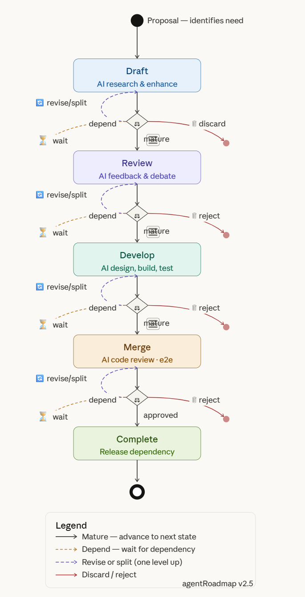

# 📑 Project: agentRoadmap
**Status:** Architecture  
**Format:** Structured System Specification (Markdown)  
**Encoding:** UTF-8

---

## 1. Project Philosophy & Identity
The `agentRoadmap` is an agent-native orchestration platform for lean product development. Best for OPC.


```text
It's vision & directive driven development using RFC state machine
    Proposal to identifies a need: product, feature, component, process, change
                        ⬇️
**Draft**       AI research and enhance 💬 discussion & critics
                    Summary         – What
                    Motivation      – Why
                    Design          – How it works
                    Drawbacks       – Issues and tradeoffs
                    Alternatives    – Other consideration
                    Dependency      - Depends on 
                    Priority        - How urgent and impactiful
                        ⬇️       *Mature* ⚖️*decision* | ⏳*Wait for*🔗*depend* |🗑️*discard*
**Review**      AI feedback, comment, discuss, debate
                        to define 📄acceptance criterias
                        ⬇️       *Mature* ⚖️*decision* 🔄*iteration* ⬆ | ⏳*Wait for* 🔗*depend* |❌**Rejected**
**Develop**     AI design, build, test 
                        codes, tests, proven tests result
                        ⬇️       *Mature* ⚖️*decision* 🔄*iteration* ⬆ | ⏳*Wait for* 🔗*depend* |❌**Rejected**
**Merge**      AI code review, regression, e2e  
                        ✅       *Mature* ⚖️*decision* 🔄*iteration* ⬆ | ⏳*Wait for* 🔗*depend* | ❌**Rejected**
                **Complete**      release dependency

🔄*iteration* can be
    *revision* with issues
    *division* into child proposal (features, components)
```

## 🍎 Maturity Lifecycle
Maturity is a universal status applied within each state to automate queue management.

* 🟢 **0: New** – Initial proposal submitted.
* 🔴 **1: Active** – Undergoing research, discussion, or active build.
* 🟢 **2: Mature** – Ready for state transition; automatically queued by priority.
* ⚪ **3: Obsolete** – Deprecated, replaced, or lost relevance.

* 🛡️ Core Principles
* **Autonomous Execution:** Machine-led; humans inject **Directives**, not manual labor.
* **Universal Entity Model:** Everything (Bug, Feature, Doc) is a `proposal`.
* **Zero-Trust Security:** Mandatory `security_acl` for every agent action.
* **Consistency Guarantees:** Conflict-free state management via a durable state layer.

---
## 📂 2. Functional Modules
| Module | Responsibility |
| :--- | :--- |
| **Product** | vision and directive driven product development, workflow by instruction to agents and pipeline, ACID control task assignment and resource allocation |
| **Workforce** | Automated recruiting and management of agent "Sprint Teams" with spending cap |
| **Efficiency Mgmt** | Model management with cost and capability tracking, memory and context management, cache optimization and local Semantic caching  |
| **Agent Utility** | Standardized MCP tool set and A2A (Agent-to-Agent) and A2H (Agent-to-Human) communication bus |
| **Human Visibility** | TUI Dashboard, Web Dashboard, Mobile App commadn centre

Exactly — financial visibility needs to be multi-level, not a single spending cap per agent. Let me map where tracking should happen:

| Level       | What                                          | Why                                |
| ----------- | --------------------------------------------- | ---------------------------------- |
| Agent       | Per-agent spend, daily cap, freeze threshold  | Stop runaway agents                |
| Proposal    | Budget allocated vs actual spend per proposal | Know which proposals are expensive |
| Model       | Cost per token, total spend per model         | Optimize model selection           |
| Team        | Aggregate spend for a proposal team           | Budget planning                    |
| System-wide | Total daily/monthly burn, trends              | Financial health                   |

And Utility  — the access layer for everyone:

| Module     | Agent access                                         | Human access                       |
| ---------- | ---------------------------------------------------- | ---------------------------------- |
| Proposal   | MCP tools (prop_get, prop_list, prop_transition)     | TUI, Web, Mobile                   |
| Workforce  | MCP tools (agent_list, team_roster, proposal_submit) | TUI, Web, Mobile                   |
| Efficiency | MCP tools (memory_refresh, model_recommend)          | Spend dashboard, model analytics   |
| Utility    | MCP messaging, naming, workflow                      | TUI cockpit, Web dashboard, Mobile |

---
## 📂 3. Folder Structure
The repository structure separates strategic intent from technical execution to minimize "Log Bloat" and merge conflicts.

```text
MyProject/
├── product/                 # Design proposals live in the control plane and are exported here for Git
│   ├── proposals/           # Read-only MD snapshots (Directives, RFCs, Caps)
│   └── attachments/         # STABLE BINARIES: Photos & Diagrams (Git LFS)
│       └── [Proposal_ID]/   # Sub-folder per Entity (e.g., RFC-105/)
├── src/                     # THE BODY: Technical & Execution Layer
│   ├── src/                 # Backend logic
│   └── test/                # Automated Validation Suites
├── ops/                     # THE EXHAUST: Operational Noise & Local Logs
└── roadmap/                 # THE EXHAUST: Operational Noise & Local Logs
│   └── docs/                # Automated Validation Suites
```

---

## 🛠️ 4. Master Data Model
The following schema sketch handles relational data (spending/audit) and semantic context (memory/search) in a portable way.

```sql
-- Optional semantic-search extension, if supported by your chosen store

-- THE UNIVERSAL ENTITY (The "Everything" Table)
CREATE TABLE proposal (
    id BIGINT PRIMARY KEY,
    display_id TEXT UNIQUE,       -- e.g., 'DIR-001', 'RFC-105'
    parent_id BIGINT REFERENCES proposal(id),
    
    -- Discriminators & Logic
    proposal_type TEXT NOT NULL,  -- DIRECTIVE, CAPABILITY, TECHNICAL, COMPONENT, OPS_ISSUE
    category TEXT,                -- FEATURE, BUG, RESEARCH, SECURITY, INFRA
    domain_id TEXT,               -- e.g., 'FINOPS', 'AI_ENGINE'
    
    -- Content & State
    title TEXT,
    body_markdown TEXT,
    body_embedding_ref TEXT,      -- Optional handle into a semantic index
    process_logic TEXT,           -- Business process description
    maturity_level INT,           -- 1-5
    status TEXT DEFAULT 'NEW',    -- NEW, DRAFT, REVIEW, ACTIVE, COMPLETE
    
    -- Governance
    budget_limit_usd NUMERIC(12,2),
    tags JSONB,                   -- Metadata for flexible filtering
    
    created_at TIMESTAMP WITH TIME ZONE DEFAULT NOW(),
    updated_at TIMESTAMP WITH TIME ZONE DEFAULT NOW()
);

-- PROVENANCE LEDGER (Git-Style Versioning)
CREATE TABLE proposal_version (
    id BIGINT PRIMARY KEY,
    proposal_id BIGINT REFERENCES proposal(id),
    author_identity TEXT,
    version_number INT,
    change_summary TEXT,
    body_delta TEXT,              -- Diff format
    metadata_delta_json JSONB,
    git_commit_sha TEXT,
    timestamp TIMESTAMP WITH TIME ZONE DEFAULT NOW()
);

-- ASSET REGISTRY
CREATE TABLE attachment_registry (
    id BIGINT PRIMARY KEY,
    proposal_id BIGINT REFERENCES proposal(id),
    file_name TEXT,
    relative_path TEXT,           -- 'product/attachments/[display_id]/file'
    content_hash TEXT,            -- SHA-256
    vision_summary TEXT,          -- AI-generated description
    timestamp TIMESTAMP WITH TIME ZONE DEFAULT NOW()
);

-- ECONOMY & GUARDRAILS
CREATE TABLE spending_caps (
    agent_identity TEXT PRIMARY KEY,
    daily_limit_usd NUMERIC(12,2),
    total_spent_today_usd NUMERIC(12,2),
    is_frozen BOOLEAN DEFAULT FALSE
);

CREATE TABLE spending_log (
    id BIGINT PRIMARY KEY,
    proposal_id BIGINT REFERENCES proposal(id),
    agent_identity TEXT,
    cost_usd NUMERIC(12,2),
    timestamp TIMESTAMP WITH TIME ZONE DEFAULT NOW()
);
```

## 🛰️ 5. 4-Layer Communication Model
1. **The Ledger (State Store):** The "Law." Persistent records and finalized decisions.
2. **The Bus (Pub/Sub):** The "Nervous System." Real-time event triggers for agents.
3. **The Mesh (ZeroMQ/P2P):** The "Forge." Ephemeral, off-the-record agent brainstorming.
4. **The Memory (Semantic Index):** The "Subconscious." Semantic retrieval of project history.

---

## 🔄 6. Implementation Roadmap
* **Phase 1 (Monolith):** Single HP DL380 Gen9 hosting 100+ local OpenClaw agents.
* **Phase 2 (Multitenancy):** Schema isolation for managing multiple products.
* **Phase 3 (Distributed):** Central Hub (Ledger) + Worker nodes via Tailscale Mesh.

---

* 🕵️ AI Integration (Prompting Metadata)
* **Strict Context:** Agents must query `proposal` (Body) ➔ `proposal_version` (Diffs) ➔ the semantic context layer before taking action.
* **Vision-First:** `attachment_registry.vision_summary` must be populated immediately for non-vision agents to "understand" diagrams.

Here's a clean emoji mapping for each concept:
| Concept  | Emoji | Reasoning |
|----------|-------|-----------|
| Revision | ✏️ | Editing/rewriting |
| Division | ➗ | Literal division sign |
| Discard | 🗑️ | Trash bin |
| Mature | 🌳 | Fully grown tree |
| Decision | ⚖️ | Scales of judgment |
| Submit | 📤 | Outbox/send |
| Postpone | ⏸️ | Pause |
| Wait for | ⏳ | Hourglass in progress |
| Depend | 🔗 | Chain/link |
| Iteration | 🔄 | Circular repeat |
| Research | 🔬 | Microscope |
| Build | 🏗️ | Construction |
| POC | 🧪 | Test tube / experiment |
| Directive | 📣 | Megaphone/directive out |
| Component | 🧩 | Puzzle piece |
| Discussion | 💬 | Speech bubbles |
| Chat | 🗨️ | Single speech bubble |

A few alternates worth considering:
- **Revision** → 🔁 if it implies a full cycle, not just a single edit
- **Mature** → 🍎 (ripe fruit) if tree feels too abstract
- **Directive** → 👆 or 📋 if it's more of an instruction/order
- **POC** → 🔭 if it's more exploratory/visionary than experimental
