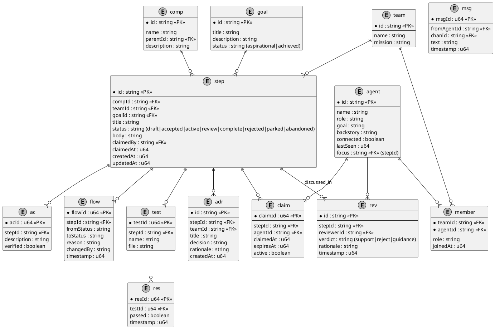

# sdb (Postgres) ERD: Agent-Native Product Development Platform

This document maintains the canonical ERD for the **sdb** (Postgres) neural core. 
Tables follow the **RFC Lifecycle** for all product steps.

## Visual Diagram (PlantUML)

## How to Request Changes
...